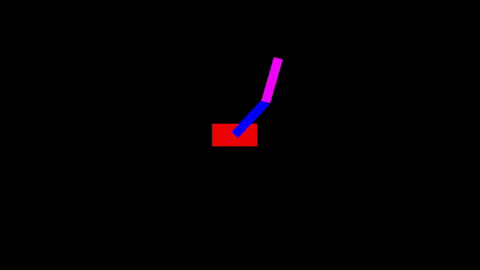

# Double pendulum on a cart simulator

This application illustrates the simulation of a double pendulum on a cart. The code also exposes the functions for controlling the pendulum using different control algorithms



## Installation
1. Clone the repository.

2. Install the appropriate dependencies.
    1. [Armadillo](https://arma.sourceforge.net/)
    2. [SFML](https://www.sfml-dev.org/)
    2. [OpenMP](https://www.openmp.org/)

3.  Build the software: 
    1. Navigate to the home location of the directory you have cloned.
    2. Generate a build directory and navigate to it:
    ```
    $ mkdir build && cd build 
    ```
    3. Execute the CMake file:
    ```
    $ cmake ..
    ```
    4. Build the executable:
    ```
    $ make -j4
    ```
    > **Note**: Using the command ”-j4” we ask the compiler to use 4 threads for build the executable. The user can use as many as they prefer.